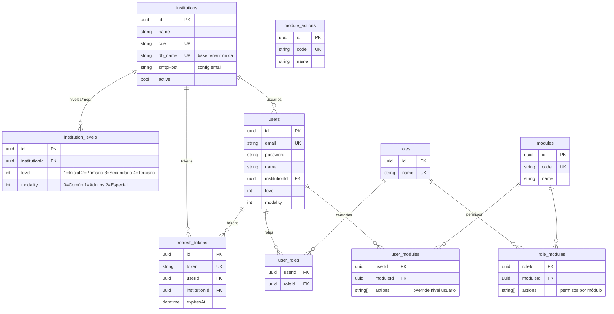

# EducandoW — Diagrama Entidad-Relación

## BASE MASTER (gestión institucional, usuarios, RBAC)



## BASE TENANT (datos pedagógicos por institución)

```mermaid
erDiagram
    students ||--o{ student_guardians : "tutores"
    students ||--o{ enrollments : "matrículas"
    students ||--o{ notas : "calificaciones"
    students ||--o{ notas_trimestrales : "finales"
    students ||--o{ attendances : "asistencias"

    academic_cycles ||--o{ enrollments : ""
    academic_cycles ||--o{ attendances : ""

    teachers ||--o{ subject_assignments : "asignaciones"

    subjects ||--o{ subject_assignments : ""
    subjects ||--o{ attendances : "materia (opc.)"
    subjects ||--o{ study_plan_subjects : ""

    course_sections ||--o{ subject_assignments : ""
    course_sections ||--o{ attendances : ""
    course_sections ||--o{ study_plan_courses : ""

    subject_assignments ||--o{ evaluaciones : "evaluaciones"
    subject_assignments ||--o{ notas_trimestrales : ""

    evaluaciones ||--o{ notas : ""

    grade_scales ||--o{ grade_scale_values : "valores"
    grade_scale_values ||--o{ notas : "escala aplicada"

    periodos_evaluacion ||--o{ notas_trimestrales : ""

    attendance_statuses ||--o{ attendances : "estado"

    study_plans ||--o{ study_plan_courses : "cursos"
    study_plan_courses ||--o{ study_plan_subjects : "materias"

    students {
        uuid id PK
        string firstName
        string lastName
        string dni UK
        string email
        date birthDate
        string guardianName
        string guardianPhone
        string userId "link a master.users"
    }

    student_guardians {
        uuid studentId FK
        uuid userId FK "master.users"
        enum relationship "mother|father|legal_guardian|other"
    }

    teachers {
        uuid id PK
        string firstName
        string lastName
        string dni UK
        string email
        string title
    }

    academic_cycles {
        uuid id PK
        string name
        int level
        int modality
        date startDate
        date endDate
    }

    enrollments {
        uuid id PK
        uuid studentId FK
        uuid cycleId FK
        int level
        int modality
        string academicYear
        string grade
        string division
        string status "ACTIVE|INACTIVE|GRADUATED"
    }

    subjects {
        uuid id PK
        string name
        int level
        int modality
    }

    course_sections {
        uuid id PK
        string name
        string grade
        string division
        int level
        int modality
        string academicYear
    }

    subject_assignments {
        uuid id PK
        uuid subjectId FK
        uuid teacherId FK
        uuid courseSectionId FK
    }

    grade_scales {
        uuid id PK
        string name "Primaria Numérica, Inicial Cualitativa"
        int level
        int modality
        float minValue
        float maxValue
        bool isConceptual
    }

    grade_scale_values {
        uuid id PK
        uuid scaleId FK
        string code "10, DESTACADO, A"
        string label "Excelente (10)"
        float numericValue
        bool isApproved
        int sortOrder
    }

    evaluaciones {
        uuid id PK
        uuid assignmentId FK
        string title
        datetime evaluationDate
        float weight
    }

    notas {
        uuid id PK
        uuid evaluationId FK
        uuid studentId FK
        float numericValue
        string qualitativeValue
        uuid gradeScaleValueId FK
        string gradeCode "SNAPSHOT histórico"
        string gradeLabel
        bool isApproved
    }

    notas_trimestrales {
        uuid id PK
        uuid studentId FK
        uuid assignmentId FK
        uuid periodId FK
        float finalGrade
        float attendancePct
    }

    periodos_evaluacion {
        uuid id PK
        string academicYear
        string name
        date startDate
        date endDate
    }

    attendance_statuses {
        uuid id PK
        string code UK "PRE|AUS|TAR|JUS|RET"
        string description
        float absenceValue "0=no suma 0.5=media 1=completa"
        bool isPresent
    }

    attendances {
        uuid id PK
        uuid studentId FK
        uuid courseSectionId FK
        uuid subjectId FK
        uuid cycleId FK
        date date
        uuid statusId FK
        string statusCode "SNAPSHOT histórico"
        string statusDescription
        float absenceValue
        bool isPresent
    }

    study_plans {
        uuid id PK
        string name
        int level
        int modality
        string academicYear
    }

    study_plan_courses {
        uuid id PK
        uuid studyPlanId FK
        uuid courseSectionId FK
    }

    study_plan_subjects {
        uuid id PK
        uuid studyPlanCourseId FK
        uuid subjectId FK
        int hoursPerWeek
    }
```



## Resumen de tablas

| DB | Tabla | Registros | Función |
|----|-------|-----------|---------|
| Master | institutions | pocos (1-50) | Datos institucionales y config |
| Master | institution_levels | por institución | Niveles/modalidades habilitadas |
| Master | users | cientos | Cuentas de acceso |
| Master | refresh_tokens | por sesión | JWT refresh tokens |
| Master | roles | fijos (~10) | Roles del sistema |
| Master | user_roles | por usuario | Asignación de roles |
| Master | modules | fijos (~15) | Módulos funcionales |
| Master | module_actions | fijos (~20) | Acciones por módulo |
| Master | role_modules | por rol | Permisos de cada rol |
| Master | user_modules | excepcionales | Overrides a nivel usuario |
| | | | |
| Tenant | students | miles | Legajo de alumnos |
| Tenant | student_guardians | por alumno | Tutores vinculados |
| Tenant | teachers | cientos | Planta docente |
| Tenant | academic_cycles | por año | Ciclos lectivos |
| Tenant | enrollments | por alumno | Matrículas por año |
| Tenant | subjects | fijos (~30) | Catálogo de materias |
| Tenant | course_sections | decenas | Cursos/divisiones |
| Tenant | subject_assignments | por curso | Docente ↔ Materia ↔ Curso |
| Tenant | grade_scales | por nivel | Escalas de calificación |
| Tenant | grade_scale_values | por escala | Valores de la escala |
| Tenant | evaluaciones | por asignación | Instancias de evaluación |
| Tenant | notas | por evaluación | Calificación individual |
| Tenant | periodos_evaluacion | por año | Trimestres/cuatrimestres |
| Tenant | notas_trimestrales | por período | Nota final trimestral |
| Tenant | attendance_statuses | fijos (5) | Catálogo de estados |
| Tenant | attendances | muchas | Registro diario de asistencia |
| Tenant | study_plans | por año | Planes de estudio |
| Tenant | study_plan_courses | por plan | Cursos del plan |
| Tenant | study_plan_subjects | por curso | Materias del curso |

## Relaciones clave entre las dos bases

```
MASTER.users.id  ──→  TENANT.students.userId  (usuario vinculado al alumno)
MASTER.users.id  ──→  TENANT.student_guardians.userId  (usuario tutor)
MASTER.institutions.db_name  ──→  conexión a la base tenant correcta
```
